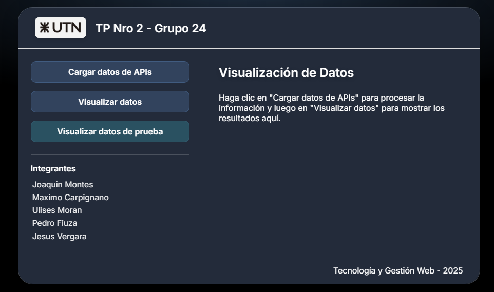

# Trabajo Grupal - Tecnología y Gestión Web - Grupo 24

  

## Trabajo Práctico N°2

Este proyecto consiste en el desarrollo de una aplicación web que permite consultar, almacenar y visualizar información sobre los géneros de películas más populares, integrando el uso de APIs externas y un CMS headless (Strapi).

---

### **Integrantes**
- Montes Joaquin
- Carpignano Maximo
- Moran Ulises
- Fiuza Pedro
- Vergara Jesus 

---

## ¿Qué hace la aplicación?

La app permite:
- Consultar la API de The Movie DB para obtener todos los géneros de películas y la cantidad de películas asociadas a cada uno.
- Almacenar el top 10 de géneros más populares en Strapi, usando la API provista por la cátedra.
- Visualizar esos datos en el frontend, tanto en formato de lista como en un gráfico de barras interactivo.
- Probar la visualización con datos de ejemplo, en caso de que Strapi no esté disponible.

---

## **Flujo de la aplicación**

1. **Generación de información**
   - Al presionar el botón "Traer datos de las APIs", la app consulta la API de The Movie DB.
   - Se obtiene la lista de géneros y, para cada uno, se consulta cuántas películas tiene asociadas.
   - Se ordenan los géneros por cantidad de películas y se selecciona el top 10.

2. **Almacenamiento en Strapi**
   - El top 10 de géneros se envía a Strapi mediante su API REST.
   - Antes de guardar, se eliminan los datos anteriores para evitar duplicados.
   - Los datos quedan almacenados en la colección correspondiente de Strapi.

3. **Búsqueda y visualización**
   - Al presionar “Ver mis resultados”, la app consulta la API de Strapi para obtener los géneros almacenados.
   - Se muestran en una lista ordenada y en un gráfico de barras (usando Chart.js) para facilitar la comparación visual.
   - Si Strapi no está disponible, se puede usar el botón “Probar visualización (modo demo)” para ver un ejemplo de la visualización.

---

## **Tecnologías utilizadas**

- **Frontend:** HTML, CSS (diseño minimalista y responsivo), JavaScript.
- **APIs externas:** The Movie DB (para obtener géneros y conteos).
- **Backend/CMS:** Strapi (para almacenar y servir los datos).
- **Visualización:** Chart.js (para el gráfico de barras).

---

## **Detalle de las APIs utilizadas**

- `GET /genre/movie/list`: Obtiene todos los géneros de películas.
- `GET /discover/movie?with_genres={id}`: Obtiene la cantidad de películas para un género específico.
- **Strapi API:**  
  - `POST /api/[coleccion]`: Guarda los datos procesados.
  - `GET /api/[coleccion]`: Recupera los datos almacenados.

---

## **Cómo usar la app**

1. **Obtener y guardar datos reales**
   - Haz clic en “Traer datos de las APIs” para consultar y guardar el top 10 en Strapi.
2. **Visualizar los resultados**
   - Haz clic en “Ver mis resultados” para ver la lista y el gráfico con los datos reales.
3. **Modo demo**
   - Si Strapi no responde, usa “Probar visualización (modo demo)” para ver un ejemplo de la visualización.

---

### <3
